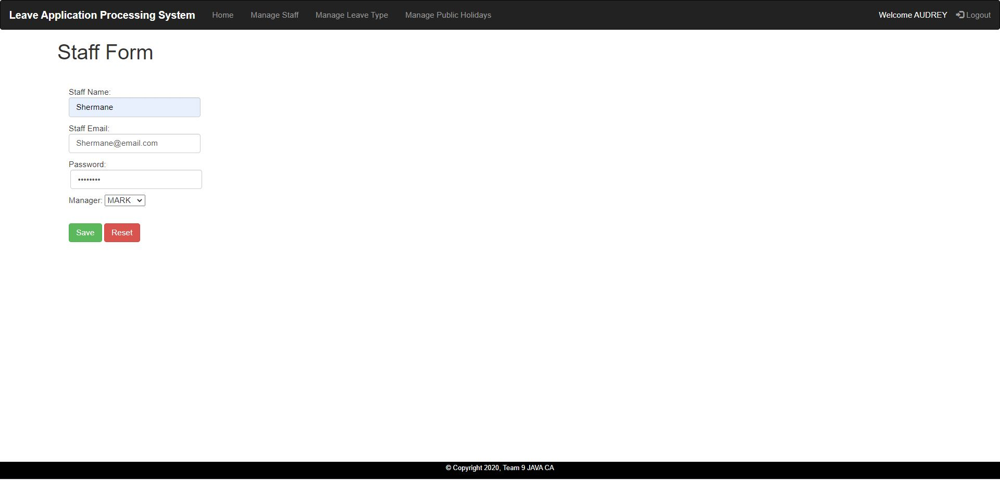

# Leave-System
A leave application processing system that accommodates three levels of employee roles and multiple leave categories using Java, Thymeleaf, HTML5, JS, CSS. 
## Admin Login Page

### Invalid Username

### Invalid Password

### Admin Dashboard

### Staff List

### Add new staff

### Staff Form Validation

### Leave Type List

### Add new leave

### Leave Form Validation

### Holiday List

### Add new holiday

### Holiday Form Validation

### Employee Login Page (For Staff and Manager)

### Staff Dashboard

### Leave Application Form

### Leave Application Form Validations

### Claim Compensation Form

### Leave Application History

### Edit Leave Application

### Manager Dashboard

### Subordinates Leave Approval List

### View Subordinate Leave Application 
To approve/reject  leave application. 
Managers may also view other subordinates leave application that fall within the period of the current application to check if there is enough manpower.

When no other leave applications fall within the period of the current application

### Subordinates Leave History 

